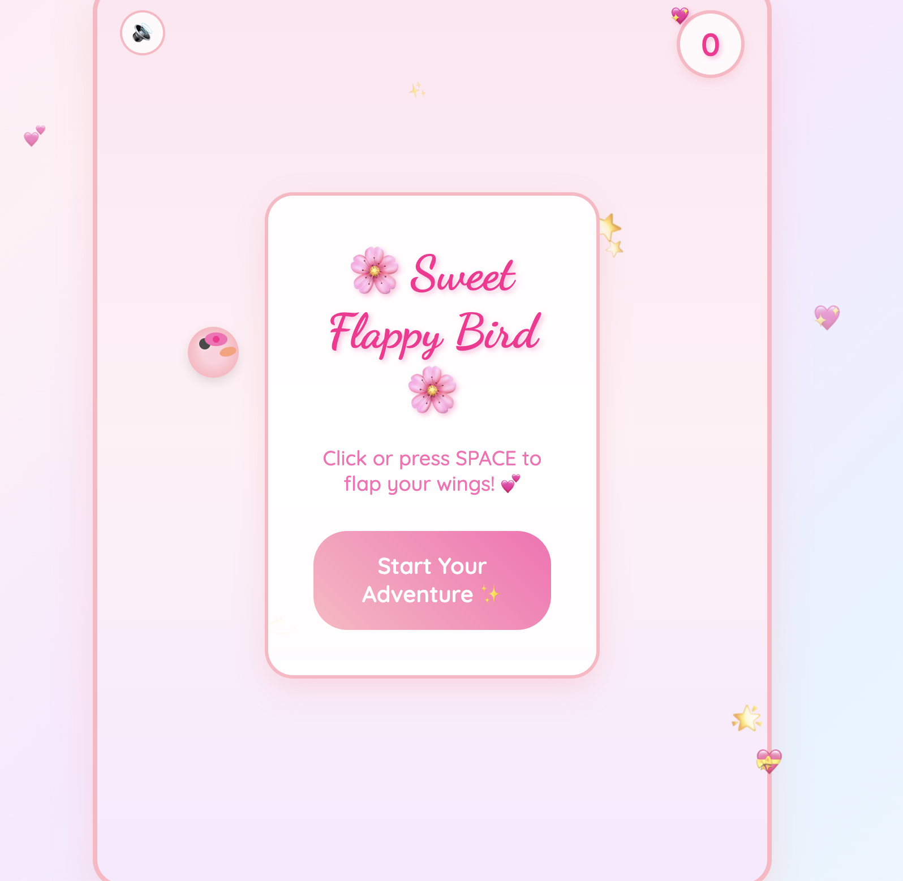

# 🌸 Sweet Flappy Bird - Queen's Adventure 🌸

A beautiful, feminine-themed Flappy Bird game created with love and creativity! This single HTML file game features pastel colors, cute animations, and a magical gaming experience designed specifically for a soft, fun, and personal touch.


## 📸 Screenshots

### 🎮 Gameplay

*Beautiful gameplay with heart trails and sweet pipes*

### 🌸 Start Screen

*Elegant start screen with feminine design*

### 🏆 Achievement Popup

*Level up achievement with encouraging message*

### 💕 Different Background Themes

*Various beautiful background color schemes*

## ✨ Features

### 🎨 **Feminine Soft Theme**
- **Pastel Color Palette:** Soft pinks, lavenders, and baby blues
- **Beautiful Gradients:** Smooth transitions between colors
- **Rounded Design:** Elegant, soft edges throughout
- **Cute Fonts:** Dancing Script for titles, Quicksand for text

### 🐦 **Cute Bird Character**
- **Soft Pink Bird:** Adorable round shape with gentle colors
- **Cute Bow:** Pink bow on top of the bird's head
- **Realistic Physics:** Smooth gravity and jumping mechanics
- **Flap Animation:** Gentle scaling and rotation effects

### 💕 **Magical Effects**
- **Heart Trails:** Hearts appear behind the bird when flapping
- **Floating Sparkles:** Animated stars and sparkles in background
- **Blinking Hearts:** Multiple hearts with different animation timings
- **Twinkling Stars:** Complex star animations with rotation

### 🍭 **Sweet-Themed Obstacles**
- **Candy Cane Pipes:** Pink and light pink striped pipes
- **Rounded Corners:** Soft, elegant pipe design
- **Sweet Caps:** Decorative caps on pipe ends
- **Generous Spacing:** Comfortable gaps between pipes

### 🎯 **Dynamic Background System**
- **8 Beautiful Themes:** Different color schemes for each level
- **Level Progression:** Background changes every 2 points
- **Smooth Transitions:** 1-second color transitions
- **Motivational Names:** Each level has a unique theme name

### 🏆 **Achievement System**
- **Level Indicators:** Shows current level at top center
- **Achievement Popups:** Beautiful notifications for level ups
- **Encouraging Messages:** Sweet, empowering game over messages
- **Progress Tracking:** Visual feedback for player progress

### 🔊 **Sound Effects**
- **Optional Audio:** Toggle button in top-left corner
- **Jump Sounds:** Cute beep when flapping
- **Score Sounds:** Higher pitch for scoring points
- **Hit Sounds:** Lower pitch when game ends

## 🎮 How to Play

### **Getting Started**
1. **Open the Game:** Simply open `flappy.html` in any web browser
2. **Start Adventure:** Click "Start Your Adventure ✨" button
3. **Control the Bird:** Click anywhere or press SPACE to flap
4. **Navigate Pipes:** Avoid hitting the sweet candy pipes
5. **Score Points:** Pass through pipes to earn points
6. **Level Up:** Every 2 points unlocks a new background theme

### **Controls**
- **Mouse Click:** Flap wings
- **Spacebar:** Flap wings
- **Touch:** Works on mobile devices
- **Sound Toggle:** Click 🔊 button to toggle audio

### **Scoring System**
- **1 Point:** Pass through each pipe
- **Level Up:** Every 2 points = new background color
- **8 Levels:** Different themes from pink to golden
- **Unlimited:** Keep playing for higher scores!

## 🌈 Level Themes

| Level | Theme Name | Color Scheme |
|-------|------------|--------------|
| 1 | 🌸 Sweet Beginner | Soft Pink |
| 2 | 💕 Pink Dreamer | Deeper Pink |
| 3 | 🌤️ Sky Explorer | Sky Blue |
| 4 | 💜 Lavender Magic | Lavender |
| 5 | 🌿 Mint Fresh | Mint Green |
| 6 | 🍑 Peach Paradise | Peach |
| 7 | 🌺 Thistle Queen | Thistle |
| 8 | ✨ Golden Goddess | Golden |

## 🛠️ Technical Details

### **Single File Architecture**
- **Complete Game:** Everything in one HTML file
- **No Dependencies:** No external libraries required
- **Self-Contained:** CSS and JavaScript embedded
- **Cross-Platform:** Works on all modern browsers

### **Technologies Used**
- **HTML5:** Game structure and elements
- **CSS3:** Styling, animations, and responsive design
- **JavaScript:** Game logic and interactivity
- **Web Audio API:** Sound effects generation
- **Google Fonts:** Beautiful typography

### **Performance Features**
- **Smooth Animations:** 60fps gameplay
- **Optimized Rendering:** Efficient canvas operations
- **Memory Management:** Automatic cleanup of elements
- **Responsive Design:** Works on all screen sizes

## 🎨 Design Philosophy

### **Feminine Aesthetics**
- **Soft Colors:** Pastel palette for gentle appeal
- **Rounded Shapes:** No sharp edges, everything is soft
- **Elegant Typography:** Beautiful fonts for readability
- **Magical Atmosphere:** Sparkles, hearts, and dreamy effects

### **User Experience**
- **Encouraging Messages:** Positive reinforcement
- **Comfortable Difficulty:** Generous pipe spacing
- **Visual Feedback:** Clear indicators and animations
- **Accessible Design:** Easy to understand and play

### **Personal Touch**
- **Designer Signature:** "Designed by Lujain Azzam ©"
- **Unique Features:** Heart trails and sweet pipes
- **Custom Animations:** Special effects for this version
- **Motivational Elements:** Empowering messages throughout

## 🚀 Getting Started

### **Quick Start**
```bash
# Clone the repository
git clone https://github.com/yourusername/sweet-flappy-bird.git

# Navigate to the directory
cd sweet-flappy-bird

# Open the game in your browser
open flappy.html
```

### **No Installation Required**
- Download the `flappy.html` file
- Double-click to open in any web browser
- Start playing immediately!

## 📱 Browser Compatibility

| Browser | Status | Notes |
|---------|--------|-------|
| Chrome | ✅ Full Support | Recommended |
| Firefox | ✅ Full Support | Works perfectly |
| Safari | ✅ Full Support | Great performance |
| Edge | ✅ Full Support | Modern versions |
| Mobile Browsers | ✅ Full Support | Touch controls work |

## 🎯 Game Features in Detail

### **Bird Physics**
- **Gravity:** Realistic falling motion
- **Jump Power:** Responsive upward movement
- **Rotation:** Bird tilts based on velocity
- **Collision Detection:** Precise hit detection

### **Pipe Generation**
- **Random Heights:** Varied pipe positions
- **Consistent Spacing:** Comfortable gaps
- **Smooth Movement:** Pipes move at steady pace
- **Memory Management:** Automatic cleanup

### **Visual Effects**
- **Heart Trails:** Appear behind bird when flapping
- **Background Elements:** Floating hearts and stars
- **Level Transitions:** Smooth color changes
- **Achievement Animations:** Popup notifications

### **Audio System**
- **Web Audio API:** Generated sound effects
- **Volume Control:** Toggle on/off
- **Different Tones:** Unique sounds for different actions
- **Browser Compatible:** Works without external files

## 🌟 Special Features

### **Dynamic Backgrounds**
- **8 Unique Themes:** Each with different color schemes
- **Smooth Transitions:** 1-second color changes
- **Level-Based Progression:** Unlock new themes as you play
- **Motivational Names:** Each level has a special title

### **Achievement System**
- **Level Indicators:** Shows current level
- **Achievement Popups:** Celebrate milestones
- **Encouraging Messages:** Positive reinforcement
- **Progress Tracking:** Visual feedback

### **Personal Signature**
- **Designer Credit:** "Designed by Lujain Azzam ©"
- **Elegant Styling:** Beautiful typography
- **Hover Effects:** Interactive elements
- **Professional Touch:** Adds personal branding

## 🎨 Customization

### **Easy to Modify**
- **Colors:** Change in CSS variables
- **Animations:** Adjust timing and effects
- **Sounds:** Modify frequencies and durations
- **Text:** Update messages and names

### **Extensible Design**
- **Modular Code:** Well-organized structure
- **Clear Comments:** Easy to understand
- **Separate Sections:** CSS, HTML, and JavaScript
- **Documentation:** Inline code comments

## 📄 License

This project is created with love and is open for personal use and learning.

**Designer:** Lujain Azzam ©

## 🙏 Acknowledgments

- **Original Flappy Bird:** Inspired by the classic game
- **Google Fonts:** Beautiful typography
- **Web Standards:** Modern web technologies
- **Creative Community:** Support and inspiration

## 📞 Contact

**Designer:** Lujain Azzam  
**Project:** Sweet Flappy Bird - Queen's Adventure

---

*Made with 💕 and lots of sparkles ✨*

**Enjoy your magical Flappy Bird adventure! 👑🌸**
